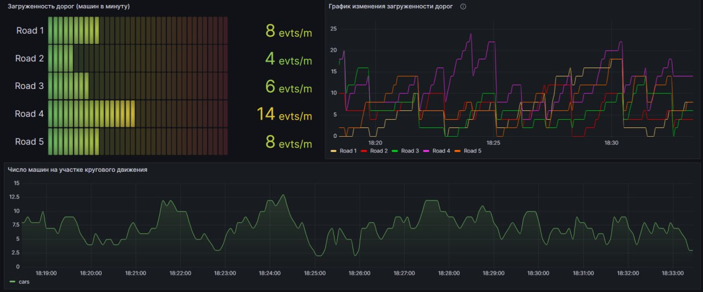
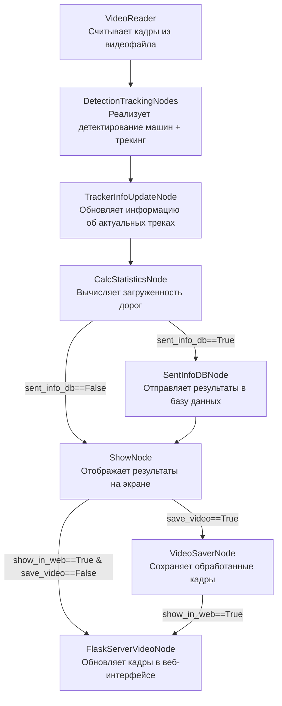

# Анализ трафика на круговом движении

Данная программа осуществляет анализ входящего трафика на участке кругового движения. Алгоритм определяет загруженность примыкающих дорог и выводит интерактивную статистику.

Подробный туториал по проекту - [__ссылка на видео__](https://youtu.be/u9EtqHz4Vqc)

## Установка:
Необходима версия Python >= 3.10 (лучше 3.10.14)
```
pip install torch torchvision torchaudio --index-url https://download.pytorch.org/whl/cu118
pip install -r requirements.txt
```
## Работа с программой:
Перед запуском необходимо в файле __configs/app_config.yaml__ указать все желаемые параметры. Далее можно запускать код.

Классический запуск кода:
```
python main.py
```
Пример запуска в дебаг режиме (профилировщик):
```
python main.py hydra.job_logging.root.level=DEBUG
```
---

Оптимизированный код с помошью multiprocessing позволяет добиться более высокой скорости обработки (>30 fps). Для его запуска необходимо запустить терминальную команду:
```
python main_optimized.py 
```
Для тестирования работы проекта в репозитории уже имеется видео test_videos/test_video.mp4. 
Кроме того, у вас есть возможность загрузить более длинное видео, пройдя по следующей ссылке: [Google Drive ссылка](https://drive.google.com/file/d/18zeVSqqgNoxIerP6XyBE4jenECLLdBkD/view?usp=sharing).

Чтобы запустить проект с определенным видео, необходимо указать путь к нему в файле конфигурации configs/app_config.yaml проекта в разделе video_reader.src.

---
## Примеры работы кода:

__Пример работы алгоритма c выводом статистики__: каждая машина отображается цветом, соответствующим дороге, с которой она прибыла к круговому движению + выводится значение числа видимых машин + значения интенсивности входного потока (число машин в минуту с каждой входящей дороги). <br/>Отображается таким образом при выборе в конфигурации show_node.show_info_statistics=True 


Отключить отображение окна со статистикой можно при выборе в конфигурации show_node.show_info_statistics=False <br/>
Чтобы наблюдать fps обработки как в первом представленном примере, необходимо в конфиге указать show_node.draw_fps_info=True.  <br/>При наличии GPU получается достигнуть порядка 30-40 кадров в секунду в случае запуска __main_optimized.py__

---
__Пример режима демонстрации трекинга машин__ (каждый id своим уникальным цветом отображается) <br/>
Отображается таким образом при выборе в конфигурации show_node.show_track_id_different_colors=True 


---
## Включение сторонних сервисов для визуализации результатов:
Программа позволяет вести запись актуальной статистики о машинопотоке в базу данных PostgreSQL и тут же осуществлять визуализацию в виде интерактивного дашборда Grafana.




Тем самым у конечного потребителя этого приложения имеется возможность запустить код один раз, подключив на вход RTSP поток или заготовленный видеофайл, и постоянно получать актуальную статистику, а также просматривать историю загруженности участка движения.

### Что нужно сделать для запуска кода в таком режиме:
1. Необходимо в файле configs/app_config.yaml в разделе pipeline указать sent_info_db=True.
2. Необходимо установить все сервисы. Для этого нужно поднять компоуз из контейнеров и создать папки, в которые будут прокинуты вольюмы от них. Чтобы это сделать, требуется в терминале запустить написанный bat-файл:
```
run_services.bat
```
3. Как только убедитесь, что все три контейнеры поднялись и работают, то можно запускать сам код:
```
python main_optimized.py 
```
Для доступа в Grafana необзодимо перйти на сайт http://localhost:3111/

Пример того, как в реальном времени строятся графики на дашборде после запуска кода:


---
## Вывод обработанного видеопотока в веб-интерфейс:

Обработанные кадры можно отображать в веб-интерфейсе (вместо отдельного окна OpenCV). Бэкенд сайта реализован с использованием Flask.

Для того, чтобы запустить проект таким образом, необходимо в файле configs/app_config.yaml в разделе pipeline указать show_in_web=True и в show_node указать imshow=False. Далее можно запускать main.py или main_optimized.py и переходить по ссылке http://localhost:8100/.

Пример того, как можно запустить проект и иметь возможность одновременно смотреть стрим по порту 8100 и наблюдать интерактивный дашборд в Grafana по порту 3111:


---

## Рассмотрим, как реализован код:

Каждый кадр последовательно проходит через ноды, и в атрибуты этого объекта постепенно добавляется все больше и больше информации.


