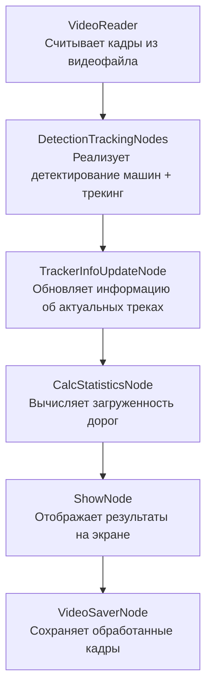

# Анализ трафика на круговом движении (версия без сторонних микросервисов)

Данная программа осуществляет анализ входящего трафика на участке кругового движения. Алгоритм определяет загруженность примыкающих дорог и выводит интерактивную статистику. 
<br/>

PS: В данной версии программного обеспечения отсутствует возможность сохранения результатов аналитики в базе данных и отображения их через графический интерфейс Grafana. Вместо этого все результаты выводятся непосредственно в открывающемся окне библиотеки OpenCV при запуске кода.

## Установка:
Необходима версия Python >= 3.10 (лучше 3.10.13)
```
pip install torch torchvision torchaudio --index-url https://download.pytorch.org/whl/cu118
pip install -r requirements.txt
```
## Работа с программой:
Перед запуском необходимо в файле __configs/app_config.yaml__ указать все желаемые параметры. Далее можно запускать код.

Классический запуск кода:
```
python main.py
```
Пример запуска в дебаг режиме (профилировщик):
```
python main.py hydra.job_logging.root.level=DEBUG
```
---

Оптимизированный код с помошью multiprocessing позволяет добиться более высокой скорости обработки (>30 fps). Для его запуска необходимо запустить терминальную команду:
```
python main_optimized.py 
```
---
## Примеры работы кода:

__Пример работы алгоритма c выводом статистики__: каждая машина отображается цветом, соответствующим дороге, с которой она прибыла к круговому движению + выводится значение числа видимых машин + значения интенсивности входного потока (число машин в минуту с каждой входящей дороги). <br/>Отображается таким образом при выборе в конфигурации show_node.show_info_statistics=True 


Отключить отображение окна со статистикой можно при выборе в конфигурации show_node.show_info_statistics=False <br/>
Чтобы наблюдать fps обработки как в первом представленном примере, необходимо в конфиге указать show_node.draw_fps_info=True.  <br/>При наличии GPU получается достигнуть порядка 30-40 кадров в секунду в случае запуска __main_optimized.py__

---
__Пример режима демонстрации трекинга машин__ (каждый id своим уникальным цветом отображается) <br/>
Отображается таким образом при выборе в конфигурации show_node.show_track_id_different_colors=True 


---
## Рассмотрим, как реализован код:

Каждый кадр последовательно проходит через ноды, и в атрибуты этого объекта постепенно добавляется все больше и больше информации.


